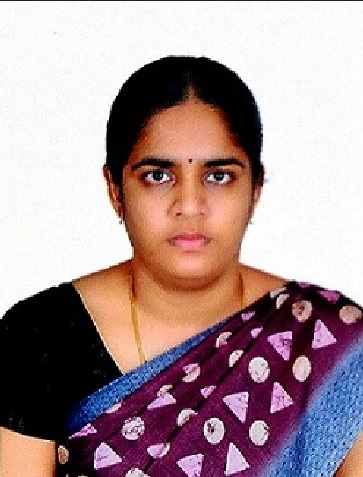

    
    

# Research Analysis and Metrics of Faculties

This page provides Research Analysis and Metrics of Faculties.

### Faculties

| Name | ORCiD | Google Scholar Publications (Overall)   Amrita Publications    Citations   h-index  i10-index | Scopus Publications (Overall)   Amrita Publications   Citations   h-index   h-index (excluding self) | 
|:----:|:-------------------:|:-------------------------------------------------------------------------------:|:-----------------------------------------------------------:|
|    [Prof. M. Sethumadhavan](https://www.amrita.edu/faculty/m-sethu)   Professor and Center Head | [0000-0001-5476-5461](https://orcid.org/0000-0001-5476-5461) | [87](https://scholar.google.co.in/citations?user=Xl_P9V0AAAAJ&hl=en)             | [74](https://www.scopus.com/authid/detail.uri?authorId=55034101000)            | 
|    [Dr. Chungath Srinivasan](https://www.amrita.edu/faculty/c-srinivasan/)   Associate Professor | [0000-0002-7027-4926](https://orcid.org/0000-0002-7027-4926) | [24](https://scholar.google.co.in/citations?user=nlt0DD4AAAAJ&hl=en)              | [21](https://www.scopus.com/authid/detail.uri?authorId=43261707200)             |
|    [Dr. P. P. Amritha](https://www.amrita.edu/faculty/pp-amritha/)   Assistant Professor (Sl. Gr.) | [0000-0002-0761-6057](https://orcid.org/0000-0002-0761-6057) | [63](https://scholar.google.co.in/citations?user=8AwtAWsAAAAJ&hl=en)               | [61](https://www.scopus.com/authid/detail.uri?authorId=36536628700)             |
|    [Dr. K. Praveen](https://www.amrita.edu/faculty/k-praveen/)   Assistant Professor (Sl. Gr.) | [0000-0002-4739-7928](https://orcid.org/0000-0002-4739-7928) | [43](https://scholar.google.com/citations?hl=en&user=NHVcW84AAAAJ&hl=en)                | [40](https://www.scopus.com/authid/detail.uri?authorId=8552046600)             |
|    [Dr. K.V. Lakshmy](https://www.amrita.edu/faculty/kv-lakshmy/)   Assistant Professor (Sl. Gr.) | [0000-0001-5344-2855](https://orcid.org/0000-0001-5344-2855) | [30](https://scholar.google.co.in/citations?user=K2n1nh0AAAAJ&hl=en)              | [27](https://www.scopus.com/authid/detail.uri?authorId=55032484300)             |
|    [Mr. Saurabh Shrivastava](https://www.amrita.edu/faculty/s-saurabh/)   Assistant Professor (Sr. Gr.) | [0000-0003-0943-6954](https://orcid.org/0000-0003-0943-6954) | [3](https://scholar.google.com/citations?user=QdXcVjUAAAAJ&hl=en)                | [3](https://www.scopus.com/authid/detail.uri?authorId=57346570300)             |
|    [Mr. R. Ramaguru](https://www.amrita.edu/faculty/ramaguru-radhakrishnan/)   Assistant Professor (Sr. Gr.) | [0000-0002-9508-5902](https://orcid.org/0000-0002-9508-5902) | [13](https://scholar.google.co.in/citations?user=-DjvKqgAAAAJ&hl=en)                | [9](https://www.scopus.com/authid/detail.uri?authorId=57210210467)             | 
|    [Dr. K.N. Ambili](https://www.amrita.edu/faculty/ambili-kakkad-narayanan/)   Assistant Professor (Sr. Gr.) | [0000-0002-8451-2497](https://orcid.org/0000-0002-8451-2497) | [11](https://scholar.google.co.in/citations?user=ZWxL_tkAAAAJ&hl=en)                | [7](https://www.scopus.com/authid/detail.uri?authorId=57200573039)             |
|    [Mr. Anand R Nair]()   Assistant Professor | [0000-0003-1598-616X](https://orcid.org/0000-0003-1598-616X) | [3](https://scholar.google.co.in/citations?user=k9PlyYkAAAAJ&hl=en)                | [2](https://www.scopus.com/authid/detail.uri?authorId=57442064600)             |
|    [Dr. V. Sujitha]()   Assistant Professor | [0000-0003-2416-2322](https://orcid.org/0000-0003-2416-2322) | [26](https://scholar.google.com/citations?user=LZW1iBEAAAAJ&hl=en)                | [11](https://www.scopus.com/authid/detail.uri?authorId=57200298624)             |
|    [Ms. Hemalatha P]()   Assistant Professor | [0000-0002-5221-521X](https://orcid.org/0000-0002-5221-521X) | [23](https://scholar.google.com/citations?user=ajH378EAAAAJ&hl=en)                | [15](https://www.scopus.com/authid/detail.uri?authorId=57201494602)             |

##### Last Updated: 09-May-2024

  

