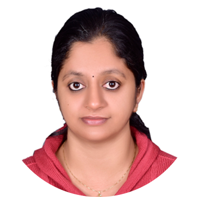

    
    

# Research Analysis and Metrics of Faculties & Research Scholars

This page provides Research Analysis and Metrics of Research Scholars.

## Research Scholars (Full-Time)

### Center of Cyber Security

| Name | ORCiD | Google Scholar Publications (Overall)   Amrita Publications    Citations   h-index  i10-index | Scopus Publications   Amrita Publications   Citations   h-index   h-index (excluding self) | 
|:-----:|:-------------------:|:-------------------------------------------------------------------------------:|:-----------------------------------------------------------:|
|    Mr. Harish R | [0000-0003-0722-6953](https://orcid.org/0000-0003-0722-6953) | [3](https://scholar.google.co.in/citations?user=weIsDiIAAAAJ&hl=en)                | [3](https://www.scopus.com/authid/detail.uri?authorId=57222348310)             | 

### Area of Cyber Security

| Name | ORCiD | Google Scholar Publications (Overall)   Amrita Publications    Citations   h-index  i10-index | Scopus Publications   Amrita Publications   Citations   h-index   h-index (excluding self) | 
|:-----:|:-------------------:|:-------------------------------------------------------------------------------:|:-----------------------------------------------------------:|
|    Mr. Rajeev K | - | [5](https://scholar.google.com/citations?user=D9kO6VgAAAAJ&hl=en)               | [5](https://www.scopus.com/authid/detail.uri?authorId=56289833000)             | 
|    Mr. Aravind Vishnu S S | [0000-0002-2374-5764](https://orcid.org/0000-0002-2374-5764) | [1](https://scholar.google.com/citations?user=8q2B8WYAAAAJ&hl=en)               | [1](https://www.scopus.com/authid/detail.uri?authorId=57223096858)             | 
|    Ms. Zeenath AU | [0000-0002-0882-5715](https://orcid.org/0000-0002-0882-5715) | [0](https://scholar.google.com/citations?user=MugxgaYAAAAJ&hl=en) | 0 | 
|    Mr. Joseph Nelson P | - | [0](https://scholar.google.com/citations?user=RnkThh8AAAAJ&hl=en) | 0 | 

## Research Scholars (Part-Time)

### Center of Cyber Security

| Name | ORCiD | Google Scholar Publications (Overall)   Amrita Publications    Citations   h-index  i10-index | Scopus Publications   Amrita Publications   Citations   h-index   h-index (excluding self) | 
|:-----:|:-------------------:|:-------------------------------------------------------------------------------:|:-----------------------------------------------------------:|
|    Ms. Vimitha R Vidhya Lakshmi | [0000-0002-6152-2780](https://orcid.org/0000-0002-6152-2780) | [6](https://scholar.google.co.in/citations?user=0QfzGcQAAAAJ&hl=en)                | [4](https://www.scopus.com/authid/detail.uri?authorId=57195988936)             |
|    Mr. Mukesh Kumar Bansal | [0000-0001-7716-0107](https://orcid.org/0000-0001-7716-0107) | [3](https://scholar.google.co.in/citations?user=_YJiNncAAAAJ&hl=en)                | [1](https://www.scopus.com/authid/detail.uri?authorId=57216649141)             |
|    Ms. Merly Annie Philip | [0000-0003-2548-6441](https://orcid.org/0000-0003-2548-6441) | [2](https://scholar.google.com/citations?&user=k8mFoKoAAAAJ&hl=en)             | [2](https://www.scopus.com/authid/detail.uri?authorId=57202992926)             |
|    Mr. Muralidharan Chandrasekaran | - | [0](https://scholar.google.com/citations?user=&hl=en) | 0 | 
|    Mr. Chandra Babu Vasasali | - | [0](https://scholar.google.com/citations?user=&hl=en) | 0 | 
|    Mr. Dalbir Singh Dahiya | - | [0](https://scholar.google.com/citations?user=&hl=en) | 0 | 
|    Mr. M R Ravi | - | [0](https://scholar.google.com/citations?user=&hl=en) | 0 | 
|    Mr. Balaganesh Bojarajulu | [0000-0003-2824-9919](https://orcid.org/0000-0003-2824-9919) | [0](https://scholar.google.com/citations?user=&hl=en) | 0 | 
|    Mr. Prasanna R | - | [0](https://scholar.google.com/citations?user=&hl=en) | 0 | 
|    Ms. Meena Lakshmi M | [0000-0003-2824-9919](https://orcid.org/0000-0001-9535-7755) | [1](https://scholar.google.com/citations?user=c3crm80AAAAJ&hl=en)                | 0 | 
|    Mr. Gabriel Anand K S | - | [0](https://scholar.google.com/citations?user=&hl=en) | 0 | 
|    Mr. Aljoscha Dietrich | - | [0](https://scholar.google.com/citations?user=&hl=en) | [10](https://www.scopus.com/authid/detail.uri?authorId=57199179227)             | 

##### Last Updated: 27-Feb-2023
